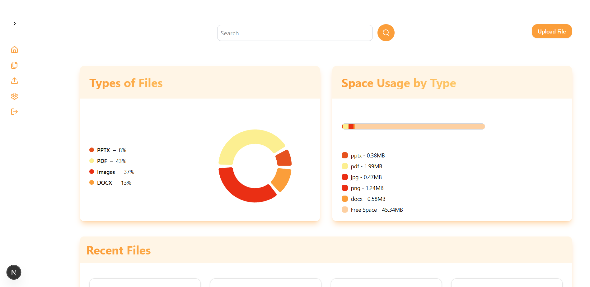
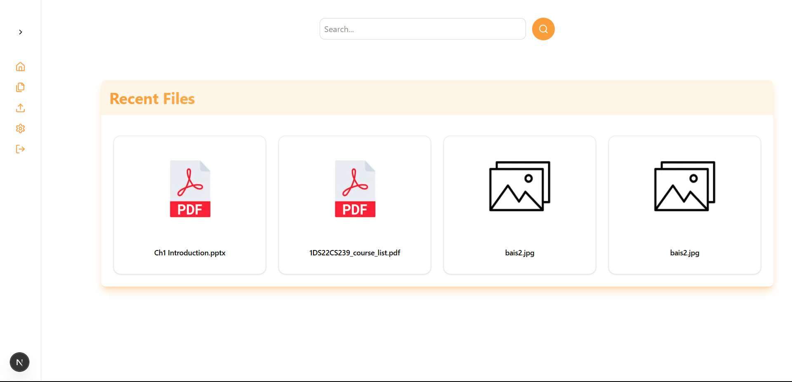
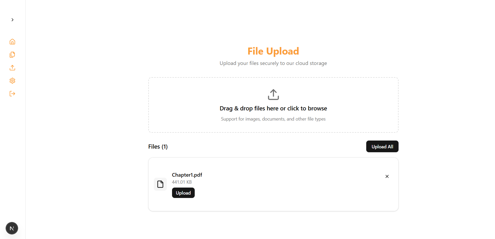

# StoreIt - Google Drive Clone

**StoreIt** is a modern, secure, and fast cloud storage platform built with Next.js 15, serving as a personal Google Drive alternative. Upload, manage, and organize your files with an intuitive dashboard and powerful analytics.

## 📸 Screenshots

### Dashboard Overview


### File Management


### File Upload Interface


## 🚀 Features

- **🔐 Authentication**: Secure user authentication with Supabase Auth
- **📁 File Management**: Upload, view, and organize files with drag-and-drop support
- **📊 Analytics Dashboard**: Visual insights with pie charts and bar charts for storage usage
- **🔍 Search**: Real-time file search functionality
- **📱 Responsive Design**: Mobile-first design with TailwindCSS
- **🎨 Modern UI**: Beautiful interface built with Radix UI components
- **⚡ Real-time Updates**: Live file updates and progress tracking
- **🗂️ File Type Support**: Support for PDFs, images, documents, and more
- **📈 Storage Analytics**: Track storage usage and file distribution

## 🛠️ Tech Stack

- **Frontend**: Next.js 15, React 19, TypeScript
- **Backend**: Supabase (Database, Authentication, Storage)
- **Styling**: TailwindCSS, Radix UI
- **State Management**: Redux Toolkit with Redux Persist
- **Charts**: Recharts for data visualization
- **Form Handling**: React Hook Form with Zod validation
- **File Upload**: Drag-and-drop with progress tracking
- **Icons**: Lucide React

## 📦 Installation

### Prerequisites

- Node.js 18+ 
- npm/yarn/pnpm
- Supabase account

### Clone the Repository

```bash
git clone https://github.com/yourusername/google_drive_clone.git
cd google_drive_clone
```

### Install Dependencies

```bash
npm install
# or
yarn install
# or
pnpm install
```

### Environment Setup

1. Create a `.env.local` file in the root directory:

```env
# Supabase Configuration
NEXT_PUBLIC_SUPABASE_URL=your_supabase_url
NEXT_PUBLIC_SUPABASE_ANON_KEY=your_supabase_anon_key
SUPABASE_SERVICE_ROLE_KEY=your_service_role_key

# App Configuration
NEXT_PUBLIC_APP_URL=http://localhost:3000
```

2. Set up your Supabase project:
   - Create a new project at [supabase.com](https://supabase.com)
   - Set up authentication
   - Create storage buckets for file uploads
   - Configure RLS policies

### Database Schema

Create the following tables in your Supabase database:

```sql
-- Users table (extends Supabase auth.users)
CREATE TABLE public.users (
  id UUID REFERENCES auth.users ON DELETE CASCADE,
  user_name TEXT,
  email TEXT UNIQUE,
  phone TEXT,
  bio TEXT,
  created_at TIMESTAMP WITH TIME ZONE DEFAULT timezone('utc'::text, now()),
  PRIMARY KEY (id)
);

-- Files table
CREATE TABLE public.entries (
  id UUID DEFAULT gen_random_uuid() PRIMARY KEY,
  user_id UUID REFERENCES auth.users ON DELETE CASCADE,
  file_name TEXT NOT NULL,
  file_size BIGINT NOT NULL,
  file_type TEXT NOT NULL,
  url TEXT NOT NULL,
  created_at TIMESTAMP WITH TIME ZONE DEFAULT timezone('utc'::text, now())
);

-- Enable RLS
ALTER TABLE public.users ENABLE ROW LEVEL SECURITY;
ALTER TABLE public.entries ENABLE ROW LEVEL SECURITY;

-- RLS Policies
CREATE POLICY "Users can view own profile" ON public.users
  FOR SELECT USING (auth.uid() = id);

CREATE POLICY "Users can update own profile" ON public.users
  FOR UPDATE USING (auth.uid() = id);

CREATE POLICY "Users can view own files" ON public.entries
  FOR SELECT USING (auth.uid() = user_id);

CREATE POLICY "Users can insert own files" ON public.entries
  FOR INSERT WITH CHECK (auth.uid() = user_id);

CREATE POLICY "Users can delete own files" ON public.entries
  FOR DELETE USING (auth.uid() = user_id);
```

## 🚀 Getting Started

### Development Server

```bash
npm run dev
# or
yarn dev
# or
pnpm dev
```

Open [http://localhost:3000](http://localhost:3000) with your browser to see the application.

### Build for Production

```bash
npm run build
npm run start
```

### Docker Setup

```bash
# Build the Docker image
docker build -t storeit .

# Run the container
docker run -p 3000:3000 storeit
```

## 📁 Project Structure

```
.
├── app/                    # Next.js App Router
│   ├── (auth)/            # Authentication pages
│   ├── (dashboard)/       # Dashboard pages
│   ├── components/        # Page-specific components
│   └── globals.css        # Global styles
├── components/            # Reusable UI components
│   └── ui/               # shadcn/ui components
├── hooks/                # Custom React hooks
├── lib/                  # Utility functions
├── redux/                # Redux store and slices
├── utils/                # Server actions and utilities
│   └── supabase/         # Supabase client configuration
└── public/               # Static assets
```

## 🎯 Key Features Explained

### File Upload
- Drag-and-drop interface
- Multiple file selection
- Real-time upload progress
- File type validation
- Automatic file organization

### Dashboard Analytics
- **Pie Chart**: Visual breakdown of file types
- **Bar Chart**: Storage usage over time
- **File Grid**: Organized file display with previews
- **Search**: Real-time file search and filtering

### Authentication
- Email/password authentication
- Protected routes with middleware
- User profile management
- Secure session handling

## 🔧 Configuration

### Tailwind CSS
The project uses a custom Tailwind configuration with:
- Custom color palette
- Extended theme with component variants
- Responsive design utilities
- Custom animations

### Redux Store
- User state management
- Persistent storage with redux-persist
- Type-safe hooks and selectors

## 📝 Available Scripts

```bash
# Development
npm run dev          # Start development server

# Production
npm run build        # Build for production
npm run start        # Start production server

# Code Quality
npm run lint         # Run ESLint
npm run lint:fix     # Fix ESLint issues
```

## 🤝 Contributing

1. Fork the repository
2. Create your feature branch (`git checkout -b feature/amazing-feature`)
3. Commit your changes (`git commit -m 'Add some amazing feature'`)
4. Push to the branch (`git push origin feature/amazing-feature`)
5. Open a Pull Request

## 📄 License

This project is licensed under the MIT License - see the [LICENSE](LICENSE) file for details.

## 🙏 Acknowledgments

- [Next.js](https://nextjs.org/) - React framework
- [Supabase](https://supabase.com/) - Backend as a Service
- [Tailwind CSS](https://tailwindcss.com/) - CSS framework
- [Radix UI](https://www.radix-ui.com/) - UI components
- [Lucide](https://lucide.dev/) - Icons

## 📞 Support

If you have any questions or need help, please open an issue on GitHub.

